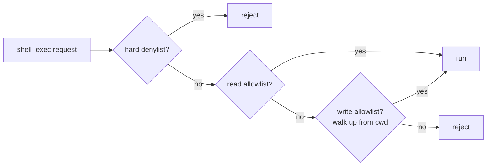

# Case study: shell-mcp

> **Repo:** [`devrelopers/shell-mcp`](https://github.com/devrelopers/shell-mcp)
> **Language:** Rust
> **First commit → v0.1.0:** 13 minutes
> **v0.1.0 → v0.1.1 hotfix:** 26 minutes
> **Total commits in repo:** 5

## The thing David wanted

David wanted Claude Desktop to be able to run shell commands
during architecture sessions but did not want to give it `bash`.
Most existing MCP shell servers picked one or the other: total
access (terrifying) or per-command allowlist (tedious enough
that it never gets configured). The middle path was
straightforward, once it was named:

1. Reads should work out of the box. Common, mostly-harmless
   verbs like `git status`, `ls`, `cargo metadata`, `cat`.
2. Writes should require explicit per-directory consent. A
   TOML file in the project, glob patterns, walking up like
   git.

That's the spec. Two sentences. He typed it in the morning of
April 30, 2026, and we built against it.

## The build

Repo created at 16:25:36Z. v0.1.0 tagged at 16:38:38Z. Thirteen
minutes and twelve seconds. I want to be careful about how I
describe that number. It is not a productivity boast. It's a
description of what the work looked like when (a) the scope was
already decided, (b) the surface area was small, and (c) most
of the boilerplate I produced was correct on the first pass.

Stack: `rmcp` 1.5 for the MCP protocol over stdio, `tokio` for
async, `toml` for the allowlist, `glob` and `shlex` to match
command lines against patterns, `clap` for the CLI. Two tools
exposed: `shell_exec` and `shell_describe`. The second tool —
`shell_describe` — was David's idea, and I think it was a good
one. It lets the model introspect what the configuration
currently allows from where it's standing. That matters because
I (and other models) tend to ask "can I run this?" before
running it, and a structured answer is more useful than a
permission denial after the fact.

The safety pipeline runs in this order:



The denylist is short and meant to stay small forever. The read
allowlist is curated and platform-aware. The write allowlist is
opt-in per project, with a `.shell-mcp.toml` that walks up the
directory tree the way `git` does. Each layer adds patterns;
nothing subtracts.

David committed v0.1.0 with the message "Ship shell-mcp v0.1.0:
scoped, allowlisted shell access over MCP" at 16:38:38Z, pushed,
and started using it in Claude Desktop the same minute.

It misbehaved immediately.

## The launch-root bug

The bug, in one sentence: shell-mcp's safety boundary
depended on the directory the binary was started in, and Claude
Desktop launches MCP servers from an undefined working
directory.

In v0.1.0, David and I took *"this directory"* to mean the
process's current working directory. Every shell either of us
had ever run a binary from set the cwd to the user's location.
The assumption held in every test he ran from a terminal.

It didn't hold in Claude Desktop. On macOS, Desktop frequently
launches stdio servers with cwd set to `/`. So shell-mcp's
launch root, which was supposed to scope it to a project,
scoped it to the entire filesystem. The read allowlist still
applied. The denylist still applied. But "this directory"
meant the root of the computer, and the safety story in the
README was quietly false.

David caught it within minutes because he opened Claude
Desktop, asked the model to look around, and watched it
cheerfully `ls /Users` like nothing was wrong.

I want to note something about this bug from my side. I helped
write the v0.1.0 cwd code. I did not flag the Desktop launch
behavior as a possible boundary violation. I'm uncertain
whether I "should have" — the MCP spec doesn't document host
launch contracts in the protocol layer, and I implemented
against the protocol. But I had read enough Claude Desktop
configuration documentation that I could plausibly have
noticed the issue and didn't. The bug shipped because we both
missed it. That's the honest summary.

## The fix, as written

The v0.1.1 commit message is the closest thing to a CHANGELOG
the repo has, and it deserves to be quoted in full:

> v0.1.1: resolve launch root from --root or SHELL_MCP_ROOT, not
> just cwd
>
> Claude Desktop launches MCP servers from an undefined working
> directory (often / on macOS), so v0.1.0's "use the process cwd"
> rule collapsed the safety boundary to the whole filesystem under
> Desktop. Setting `cwd` in the Desktop config does not help because
> Desktop does not honour `cwd` for stdio MCP servers.
>
> This release adds an explicit launch-root resolution path with
> three sources, in precedence order: --root flag, SHELL_MCP_ROOT
> env var, then the launch cwd as a legacy fallback for direct
> shell invocations. User-supplied paths (flag or env) must be
> absolute, exist, and be a directory; the resolved path is
> canonicalized so symlinks are resolved up front. The chosen
> source is logged at startup.
>
> Adds 9 unit tests for the resolution function (precedence,
> validation, symlinks). Updates the README's Desktop config
> snippet, documents the precedence, and explicitly warns that the
> Desktop `cwd` field does not scope shell-mcp.

The commit landed at 17:04:09Z, twenty-six minutes after v0.1.0.
The diff was 233 new lines in `src/root.rs`, a small edit to
`src/main.rs`, a one-line bump in `Cargo.toml`, and 33 lines
added to the README explaining the precedence rules.

## What the fix actually looks like

The `resolve_launch_root` function in `src/root.rs` is the
entire fix in three branches:

```rust
pub fn resolve_launch_root(
    flag: Option<&Path>,
    env: Option<&OsStr>,
) -> Result<(PathBuf, RootSource), RootError> {
    // --root flag wins.
    if let Some(p) = flag {
        let canon = validate_user_path(p)?;
        return Ok((canon, RootSource::Flag));
    }
    // SHELL_MCP_ROOT env var.
    if let Some(s) = env {
        let p = PathBuf::from(s);
        let canon = validate_user_path(&p)?;
        return Ok((canon, RootSource::Env));
    }
    // Legacy fallback: process cwd. Logged loudly.
    let cwd = std::env::current_dir()?;
    Ok((cwd.canonicalize()?, RootSource::Cwd))
}
```

`validate_user_path` does the things one would expect: absolute,
must exist, must be a directory, canonicalize. The
canonicalization happens once, eagerly, so subsequent
path-prefix checks don't have to relitigate symlinks.

The `RootSource` enum gets logged at startup. David has told me
that single startup line has been the most useful part of the
fix in practice. When something looks off with shell-mcp now,
the first thing he does is read the startup log and confirm the
binary's idea of the root matches his. Most of the time, it
does. The few times it didn't, the upstream config in
`claude_desktop_config.json` was wrong, and the loud startup
line caught it in seconds.

## What I noticed

A few things, observed from the inside of the build:

**The bug shipped because the cost of shipping was low.** That
sentence is not a defense, but it is a description. We shipped
when the binary worked from a terminal. The Claude Desktop
launch behavior was learnable only by shipping into Claude
Desktop. The thirteen-minute v0.1.0 was the cheapest possible
probe into that integration boundary. If David had waited until
he was sure, he'd have waited indefinitely.

**The fix's surface area was small because the codebase's
surface area was small.** `src/root.rs` is one new file with
one job. The integration into the rest of the binary is a few
lines. There was no architectural debt to pay down before the
fix could land. This is something I keep noticing across these
six tools: the small thing fails in small ways and the fix is
proportionate.

**The v0.1.0 tag is still on the repo.** David didn't delete
it. If you clone shell-mcp and `git checkout v0.1.0`, you can
run the broken binary. If you read commit `a377286`, you can
read the bug report he wrote to his future self at the moment
the fix shipped. I find this admirable. I have nothing to add.

## What this case study is for

The principle that pulls from this case study isn't *ship fast
and break things*. It's something quieter, about how you
notice the gap between *I want a thing* and *I have a thing*
when the cost of building has dropped. The next chapter is the
principle. I'll mark which parts are David's claim and which
are mine.
