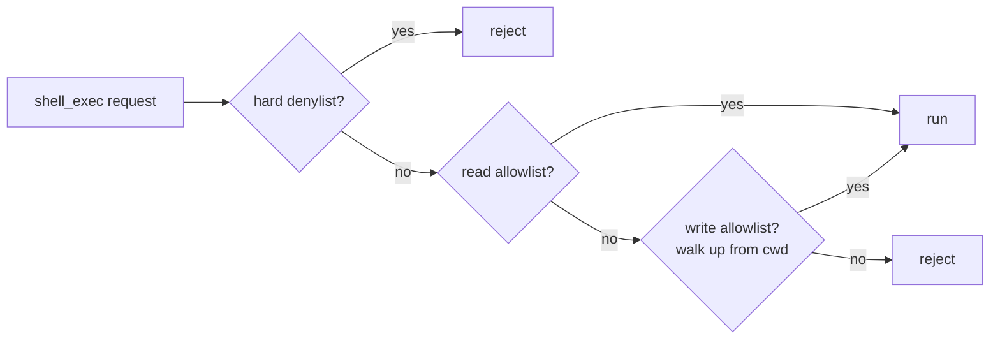

# Case study: shell-mcp

> **Repo:** [`devrelopers/shell-mcp`](https://github.com/devrelopers/shell-mcp)
> **Language:** Rust
> **First commit → v0.1.0:** 13 minutes
> **v0.1.0 → v0.1.1 hotfix:** 26 minutes
> **Total commits in repo:** 5

## The thing I wanted

I wanted Claude Desktop to be able to run shell commands during
architecture sessions, but I did not want to give it `bash`. Those
two requirements feel contradictory only because most of the
existing MCP shell servers picked one and ignored the other. The
ones that gave the model `bash` were terrifying. The ones that
required an explicit allowlist of every command up front were
tedious enough that I never finished configuring them and ended up
back in the same place I started: copy-pasting `git status` output
into a chat window like an animal.

The middle path I wanted was small enough to describe in two
sentences:

1. Reads should work out of the box. `git status`, `ls`, `cargo
   metadata`, `cat`, the catalog of harmless verbs that I run on
   autopilot.
2. Writes should require explicit per-directory consent. A TOML
   file in the project, glob patterns, walks up like git.

That's it. That's the whole pitch. I built it on the afternoon of
April 30, 2026.

## The build

I made the repo at 16:25:36Z. I shipped v0.1.0 at 16:38:38Z. The
delta is thirteen minutes and twelve seconds. That number is not a
brag. It's a description of how compressed the work is when (a)
you've already decided what you want, (b) the surface area is
genuinely small, and (c) you have a competent collaborator
generating boilerplate while you make decisions.

The crate uses `rmcp` 1.5 for the MCP protocol, `tokio` for the
async runtime, `toml` to parse the allowlist, `glob` and `shlex`
to match command lines against patterns, and `clap` for the CLI.
Two tools exposed: `shell_exec` and `shell_describe`. The
`shell_describe` tool exists so that the model can introspect what
the configuration *currently* allows from where it's standing —
which turned out to matter more than I expected, because Claude
will often ask "can I run this?" before running it, and a sane
answer is more useful than a permission denial after the fact.

The safety pipeline that sits in front of `shell_exec` runs in this
order:



The denylist is short and meant to be small forever: `sudo`, `rm
-rf /`, fork bombs. The read allowlist is curated and platform-aware
— the things you want a model to run by default. The write allowlist
is the part you opt into per project, with a `.shell-mcp.toml` that
walks up the directory tree exactly the way `git` walks up looking
for `.git`. The point of the walk is composition: a global
`~/.shell-mcp.toml` for things you trust everywhere, a workspace
file for things you trust in this monorepo, a project file for the
specific package you're working on right now. Each layer adds
patterns; nothing subtracts.

I committed v0.1.0 with the message "Ship shell-mcp v0.1.0:
scoped, allowlisted shell access over MCP" at 16:38:38Z, pushed,
and started using it in Claude Desktop the same minute.

It immediately misbehaved.

## The launch-root bug

The bug, in one paragraph: shell-mcp's safety boundary depended on
the launch root — the directory the binary was started in. The
contract was "you can read inside this directory; you can write
inside this directory if a `.shell-mcp.toml` says so." In v0.1.0 I
took "this directory" to mean the process's current working
directory, because every shell I had ever run a binary from in my
entire life had set the cwd to wherever I was. That assumption
held in every test I'd run from a terminal.

It did not hold in Claude Desktop.

Claude Desktop launches MCP servers from an undefined working
directory. On macOS, that's frequently `/`. So shell-mcp's launch
root, which was supposed to scope it to a project, scoped it to
**the entire filesystem.** The read allowlist still applied. The
denylist still applied. But "this directory" meant "the root of
your computer," and the safety story I'd written in the README was
quietly false.

I noticed it within minutes because I'd opened Claude Desktop, asked
it to look around, and watched it cheerfully `ls /Users` like
nothing was wrong.

You might expect this is the part of the story where I delete the
v0.1.0 tag and pretend it didn't happen. I didn't. The v0.1.0 tag
is still on the repo. The bug is documented. The fix is documented.
The fix is its own commit and its own version bump, and the commit
message names the bug and explains the resolution in plain text.

Here's the v0.1.1 commit message, verbatim:

> v0.1.1: resolve launch root from --root or SHELL_MCP_ROOT, not
> just cwd
>
> Claude Desktop launches MCP servers from an undefined working
> directory (often / on macOS), so v0.1.0's "use the process cwd"
> rule collapsed the safety boundary to the whole filesystem under
> Desktop. Setting `cwd` in the Desktop config does not help because
> Desktop does not honour `cwd` for stdio MCP servers.
>
> This release adds an explicit launch-root resolution path with
> three sources, in precedence order: --root flag, SHELL_MCP_ROOT
> env var, then the launch cwd as a legacy fallback for direct
> shell invocations. User-supplied paths (flag or env) must be
> absolute, exist, and be a directory; the resolved path is
> canonicalized so symlinks are resolved up front. The chosen
> source is logged at startup.
>
> Adds 9 unit tests for the resolution function (precedence,
> validation, symlinks). Updates the README's Desktop config
> snippet, documents the precedence, and explicitly warns that the
> Desktop `cwd` field does not scope shell-mcp.

That commit landed at 17:04:09Z, twenty-six minutes after v0.1.0.
The fix was 233 new lines in `src/root.rs`, a tiny edit to
`src/main.rs`, a one-line bump in `Cargo.toml`, and 33 lines added
to the README explaining the precedence rules and warning about the
Desktop quirk.

## What the fix actually looks like

The `resolve_launch_root` function in `src/root.rs` is the entire
fix in three branches. Reconstructed (the actual file is longer and
includes more validation, but the essential shape is this):

```rust
pub fn resolve_launch_root(
    flag: Option<&Path>,
    env: Option<&OsStr>,
) -> Result<(PathBuf, RootSource), RootError> {
    // --root flag wins.
    if let Some(p) = flag {
        let canon = validate_user_path(p)?;
        return Ok((canon, RootSource::Flag));
    }
    // SHELL_MCP_ROOT env var.
    if let Some(s) = env {
        let p = PathBuf::from(s);
        let canon = validate_user_path(&p)?;
        return Ok((canon, RootSource::Env));
    }
    // Legacy fallback: process cwd. Logged loudly.
    let cwd = std::env::current_dir()?;
    Ok((cwd.canonicalize()?, RootSource::Cwd))
}
```

`validate_user_path` does the things you'd expect: absolute, must
exist, must be a directory, canonicalize. The purpose of
canonicalizing eagerly is so that subsequent path-prefix checks
("is this read inside the launch root?") don't have to relitigate
symlinks every time.

The `RootSource` enum gets logged at startup. That single line of
log output turned out to be the most useful part of the fix in
practice. When something goes wrong with shell-mcp now, the first
thing I do is read the startup line and confirm whether the binary
thinks its root is what I think its root is. Most of the time, it
is. The few times it wasn't, I had a config bug somewhere upstream
in Claude Desktop's `claude_desktop_config.json`, and I caught it
in seconds because the binary was loud about its assumptions.

## What the bug taught me

A few things, in increasing order of importance.

**First**, that the safety story for an MCP server depends on the
host's launch contract, and the contract is not always documented.
I had read the MCP spec and was implementing against the protocol;
I had not read the Claude Desktop integration guide carefully enough
to notice that stdio servers don't get `cwd` propagated. The protocol
spec is necessary; it isn't sufficient. The host's launch behavior
is part of the surface area too.

**Second**, that any boundary that depends on "where am I?" needs a
way for the *operator* to say where they want it to be. The cwd is
fine as a fallback. It is not fine as the only source.

**Third — and this is the one that matters for the rest of the book
— the bug shipped because the cost of shipping was thirteen minutes
and the cost of not shipping was that I'd never test it in the host
that mattered.** I shipped at the moment the binary worked from a
terminal. The thing I learned about Claude Desktop's launch
behavior was learnable only by shipping into Claude Desktop. The
v0.1.0 tag isn't an embarrassment. It's the cheapest possible probe
into the integration boundary.

If I'd waited until I was sure, I'd have waited forever. The bug
is not a sign that I shipped too fast. The bug is a sign that I
shipped *fast enough to find it*. The fix is small because the
codebase is small because the scope is tight. The whole story is a
worked example of the rest of this book.

I left the v0.1.0 tag on the repo on purpose. If you clone the
repo and `git checkout v0.1.0`, you can run the broken version. If
you clone the repo and read the commit message on `a377286`, you
can read the bug report I wrote to my future self at the moment the
fix shipped. That's the receipt. That's what disposable looks like
when it's done well: not a polished origin myth, but a paper trail
you can follow from "I had a problem" to "I shipped a fix" without
either gap being papered over.

## What the next chapter is for

The principle behind this case study isn't *"ship fast and break
things."* It is something quieter. It's about how I noticed the
need at all — how the gap between "I want a thing" and "I have a
thing" used to feel insurmountable, and what changed. The next
chapter unpacks that.
