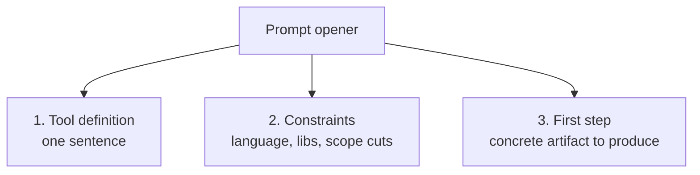

# Prompt, then pace

There's a rhythm to building disposable tools with an AI
collaborator, and most of the trouble comes from violating it.
The rhythm has two beats: **prompt** and **pace**.

Prompt is the upfront work where you fix the scope, hand the model
the constraints, and let it generate the first draft of the thing.
Pace is the afterwork where you read what came back, decide what
to keep, decide what's drifting, and give the next instruction —
small, specific, in your hand, not the model's.

If you only prompt and don't pace, the tool runs away from you.
If you only pace and don't prompt, you're just typing. The two
beats need each other and they need to alternate.

## The shape of a good prompt

The prompt that opens a disposable-tool session is not "build me
X." The prompt has three parts:

A real opener I used for clock-mcp, paraphrased and trimmed:

> *Build me a small Rust MCP server. It exposes one tool: `now`.
> The tool returns the current time in a given IANA timezone,
> defaulting to UTC. Use `rmcp` 1.5 over stdio, `chrono` and
> `chrono-tz` for the time math. No state. No config file. Errors
> as `{ error, hint }` JSON. First step: produce the Cargo.toml
> and the skeleton main.rs that compiles and serves an empty
> handler. We'll add the tool next.*

Notice what that prompt does:

- **Names the tool's purpose in one sentence.** The first sentence
  is the same one-sentence test from the chapter on scope. If you
  can't say what the tool does in one sentence, you're not ready
  to prompt yet.
- **Picks the libraries.** I'm not asking the model "what library
  should I use?" because that's a question I can answer better than
  it can. The library choice is a scope decision. I make it. The
  model executes it.
- **Cuts scope explicitly.** *No state. No config file.* These are
  the cuts. They're spoken aloud so the model doesn't drift toward
  them on its own. You'd be surprised how often the model will,
  unprompted, propose a config file. Speak the cuts.
- **Gives a concrete first step.** Not "build the whole thing."
  The first artifact is small enough that I can read every line of
  it before deciding what to do next. The first artifact also
  *compiles* — that's a forcing function. Compiling is binary. I
  can tell whether the model and I are still on the same page.

## The pace, between prompts

After the model produces the first artifact, you don't immediately
prompt again. You read what came back, line by line, with your
hands on the keyboard. You're looking for three things:

1. **Anything that doesn't match the spec.** The model might have
   imported a crate you didn't ask for. It might have stuck a
   `tracing` setup in there because it likes logging. It might
   have introduced an `Error` enum where you wanted `anyhow`.
   Each of these is a small drift. You don't ignore them. You
   note them.

2. **Anything you don't understand.** The model wrote code that
   you don't immediately follow. Stop. Read it. Understand it.
   This is the most important rule and it is the easiest one to
   skip. If you don't understand the code in the artifact, you
   don't have a tool — you have a black box you're betting on.
   Black boxes are fine in libraries you import; they are not
   fine in the actual logic of your disposable tool. The whole
   reason this thing exists is that you understand exactly what
   it does.

3. **Anything you can cut.** A first artifact will almost always
   contain things you can remove without losing the function.
   Logging you don't need yet. Comments that explain what the code
   already says. Defensive checks for inputs that can't happen.
   Cut them. The smaller the artifact, the easier the next round.

Then, and only then, you prompt again. The next prompt is
informed by what you just read. It's specific. It points at lines.
It says things like *"in `serve_now`, drop the tracing setup, and
return the JSON shape from the spec rather than a string."* Not
*"clean it up."* Not *"make it better."* Specific.

## The dangerous prompts

Some prompt shapes feel productive but produce work that drifts.
Recognize them:

- **"What do you think we should do next?"** This hands the steering
  wheel to the model. The model is competent but uncalibrated to
  your scope. It will propose plausible-sounding next features.
  Some will be in scope; some will not. The model can't tell, and
  asking it is asking the wrong oracle.

- **"Can you also..."** "Also" is the word that grew Aftermark from
  v0.1.0 to v0.4.1. Each "also" looks small. The aggregation of
  "alsos" is the scope creep from chapter five. When you feel the
  word forming, stop. Ask whether the feature you're about to add
  is in your one-sentence spec. If it isn't, write it on the
  sticky note and don't say it out loud.

- **"Make this more robust."** Robust against what? Robust how?
  This prompt produces defensive code that doesn't help, because
  the model imagines threats your tool isn't actually exposed to
  and wastes lines defending against them. Specific failure mode,
  specific defense. Or no defense at all and a clear crash.
  Disposable tools can crash. That's fine. You'll see it and
  you'll know.

- **"Refactor for cleanliness."** The model's idea of cleanliness
  is statistically average code structure. You don't want average.
  You want *the structure that makes this specific tool legible to
  you next month.* That's a judgment you make, not the model.

## The good prompts

By contrast, prompts that hold scope tight share some shapes:

- **"Add exactly this one thing."** With a precise definition of
  the thing. *"Add a `time_until` tool that takes a target
  datetime in ISO 8601 with offset, and a `now_zone` IANA name,
  and returns `{ from, to, duration_seconds, human }`."* That
  prompt has nothing to drift toward.

- **"Show me the diff before applying it."** When you're working
  in a tool that allows it (Claude Code, an editor with an
  AI plugin), making the model show you the diff before any file
  changes lets you keep pace. You read the diff. You approve or
  reject. You stay in control.

- **"Explain this line."** When the model writes code you don't
  follow, this prompt is cheap and disambiguating. It's also a
  forcing function for *the model* to defend its choice. If the
  explanation is weak, the code is probably weak. If the
  explanation is strong, you've learned something.

- **"What's the smallest version of this that works?"** A useful
  reset prompt when you feel the artifact bloating. The answer
  reorients both of you toward the tight scope.

## The orchestrator's stance

You'll notice the through-line: in every one of these prompts, you
are the one driving. The model is generating, but the *direction*
of the work — the scope, the next step, the cuts, the structure —
all of that is yours. The model is a producer. So are you. The
collaboration is two producers who each play a role.

That arrangement deserves its own chapter, and it gets one later
in the book. For now, the rhythm:

1. Prompt with a tight, specific opener.
2. Read what comes back. All of it.
3. Decide: keep, cut, modify.
4. Prompt the next small step.
5. Repeat until the tool does the thing.
6. Stop.

Step six is harder than steps one through five combined, and the
case study you just read — Aftermark — is the canonical worked
example of getting it wrong. The next case study, SlArchive, is
the worked example of getting it right.
