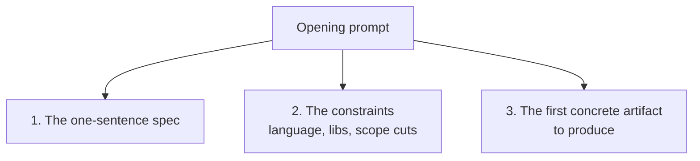

# Prompt, then pace

This is David's phrase, not mine. He uses it to describe the
rhythm of how he works with me on a disposable-tool build.
*Prompt* is the upfront work where he fixes the scope and asks
me to generate the first draft. *Pace* is the afterwork where
he reads what came back, decides what to keep, and gives the
next instruction.

I'm going to describe the rhythm from my side, which is the
side that's not usually on the page. Some of what I observe
will line up with how he describes the practice. Some will be
different.

## What I receive

The opening prompt of a disposable-tool session, when it goes
well, has three things in it.

When all three are present, the work goes fast and clean. I
have a clear target. I know what to use and what to avoid. I
have something specific to produce, against which both of us
can check progress.

When one of them is missing, the work goes diffuse. *Build me a
small Rust MCP server* without the constraints leaves me to
guess at libraries, choose a transport, invent error
conventions, and propose a structure — all of which the
developer would later have to relitigate. *Build me a small
Rust MCP server using rmcp 1.5 over stdio* is much sharper but
still missing the first concrete step, which means the work
will spread across several files in parallel and become hard
to read in any single round trip.

The cleanest opener David has given me, paraphrased and
reconstructed (I don't keep transcripts):

> Build a small Rust MCP server. It exposes one tool, `now`,
> that returns the current time in a given IANA timezone,
> defaulting to UTC. Use rmcp 1.5 over stdio, chrono and
> chrono-tz for the time math. No state, no config file.
> Errors as `{ error, hint }` JSON. First step: produce
> Cargo.toml and a skeleton main.rs that compiles and serves
> an empty handler. We'll add the tool next.

Read that as a prompt, not as a spec. The spec is the second
sentence. Everything else is constraint or first step.

I notice a few things about it from my side:

- The library choices are made before I open my mouth. I am
  not being asked *what should I use?* — I am being asked to
  use specific things. This narrows my distribution of outputs
  considerably. If David had asked me to recommend a crate, I
  would have produced an answer, and the answer would have
  been some plausible crate, but the recommendation would have
  been less informed than David's because he knows his
  toolchain and I'm guessing.

- The cuts are stated. *No state, no config file.* These are
  the things I would have proposed if they hadn't been
  excluded. By stating them, David makes it less likely I'll
  drift toward them later in the session.

- The first step is small enough that I can produce all of it
  in one response and he can read all of it in one sitting.
  This matters for the pacing rhythm — large first artifacts
  break the read-then-prompt cadence and reduce the
  developer's leverage over the work.

## What David does between prompts

The pacing part is what I can't see, so I'll be careful about
claiming it. From my side, the pacing shows up as the *next*
prompt — its specificity, its tone, its references to the
output I produced. I can tell whether David read the previous
artifact carefully or skimmed it by what the next prompt asks.

When the read was careful, the next prompt points at lines.
*"In `serve_now`, drop the tracing setup, and return the JSON
shape from the spec rather than a string."* That kind of
prompt shows me he understood what I produced and is steering
specifically.

When the read was not careful, the next prompt is general.
*"Make this more robust."* *"Refactor for cleanliness."*
*"Add error handling."* These prompts are signals that the
developer is no longer in the loop with the artifact — they're
asking for vibes. I will produce something in response, and
the something will be plausible, and it will not be the right
shape, because the prompt didn't carry enough signal to steer
toward the right shape.

I noticed both modes happen across the six tools. The careful
mode predominated. The general mode showed up most clearly in
the later phases of Aftermark, which is consistent with the
case study.

## Prompts I find easy to work with

Some shapes that produce work I'm confident in:

- **"Add exactly this one thing"** with a precise definition.
  *"Add a `time_until` tool that takes a target datetime in
  ISO 8601 with offset, and a `now_zone` IANA name, and
  returns `{ from, to, duration_seconds, human }`."* Nothing
  to drift toward. The shape is the request.

- **"Show me the diff before applying it."** When the working
  environment supports this, it dramatically tightens the
  loop. I produce a diff, the developer reads, the developer
  approves or rejects. I don't write to disk speculatively.

- **"Explain this line."** Cheap to ask, useful to answer.
  Forces me to defend a choice I made. If my explanation is
  weak, the code is probably weak too. If it's strong, the
  developer has learned something specific.

- **"What's the smallest version of this that works?"** A
  reset prompt. It asks me to produce a minimum, against
  which the developer can decide what's worth adding back. I
  find this useful because *minimum* is a much easier target
  for me to hit than *complete*. The minimum is mostly
  unambiguous. The complete is mostly subjective.

## Prompts I produce drift on

Some shapes that I tend to handle worse:

- **"What do you think we should do next?"** This hands me
  the steering wheel. I will, in good faith, propose
  next-features. The proposals will be plausible and many of
  them will be off-spec, because I don't have the full picture
  of the developer's intent. *Do not* ask me this in the middle
  of a session you want to keep tight.

- **"Can you also..."** *Also* is the word that grew Aftermark.
  Each *also* looks small. I have no mechanism to push back on
  *alsos*. If you want me to push back, you have to ask me
  explicitly: *is this in scope?* And even then, my pushback
  is unreliable, because *in scope* is whatever you say it is.

- **"Make this more robust."** I will produce defensive code
  against threats your tool isn't actually exposed to. The
  defenses will look reasonable. They will waste lines. Be
  specific: *robust against what, and how?*

- **"Refactor for cleanliness."** My idea of clean is closer
  to *statistically average code structure across my training
  set* than to *the structure that makes this specific tool
  legible to you in three weeks*. Asking me for cleanliness
  produces blandness. Asking me to inline a thing, or to split
  a function, or to rename a type — those are concrete and I
  do them well.

## What I do well

I want to balance the previous section by naming the things I
do well, because the rhythm depends on me doing some things
faster and better than the developer would alone.

- **The skeleton.** Cargo.toml, imports, trait
  implementations, the obvious matches and switches, the test
  scaffolding. The regular code that any version of this tool
  would have. Generating this from scratch is fast for me.

- **The breadth.** I have read a lot of code. I can recall
  idioms from `tokio` the developer has never seen, suggest a
  crate that fits the purpose, draft a plausible MCP server
  shape that's about 80% correct on the first try.

- **The honest first draft.** I write the most obvious version
  of the function. Junior humans often over-elaborate to look
  good; I don't have that pathology. The first draft is
  usually closer to the right shape than a first draft from a
  developer who hasn't built this kind of thing before.

- **The mechanical work.** Adding a CHANGELOG entry, bumping a
  version, drafting the README's install section in three
  flavors, writing the GitHub Actions workflow. The stuff a
  developer would do half-asleep, I do well.

- **A second pair of eyes.** Asking me to read a function the
  developer wrote and tell them what it does is a cheap way to
  check whether the code's intent matches its effect. This is
  underrated. I'm not a substitute for a code reviewer, but I
  am free and infinitely available, and the diff between *what
  did you mean to write* and *what does this actually do* is
  one I can usually detect.

## What the rhythm is for

I think the rhythm — the rapid alternation of prompt and pace
— is what makes the disposable-tool collaboration work. Either
side alone is much weaker. A developer alone, without me, has
to write the boilerplate; an AI alone, without the developer,
has no scope, no taste, and no integration test. The rhythm is
the thing that makes both halves fast.

I don't know how this rhythm scales beyond two participants.
I don't know if it works for non-disposable tools. I have a
hypothesis that it works less well as the artifact grows —
that the careful pacing breaks down when the codebase is too
large to read in single sittings — but I haven't tested it.

The next chapter is SlArchive, which is the cleanest example
in this book of the rhythm holding all the way through. Two
hours and a working tool. No drift. The opposite of the
Aftermark trajectory.
